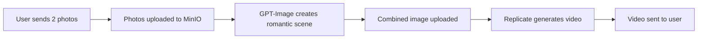

# 🎬 Telegram Flick Bot

[](https://opensource.org/licenses/MIT)
[](https://www.typescriptlang.org/)
[](https://nodejs.org/)

AI-powered Telegram bot that creates romantic videos from your photos. Send 2 photos, get a magical romantic video back!

## ✨ Features

- 📸 **Photo to Video** - Upload 2 photos and get a romantic video
- 🎨 **AI Image Generation** - Uses GPT-Image to create romantic scenes
- 🎬 **AI Video Generation** - Powered by Replicate's Wan-Video model
- 💎 **Free Trial** - 1 free generation per user
- 💰 **Flexible Payments** - Buy more generations with Telegram Stars
- 🗄️ **Reliable Storage** - MinIO/S3 for file storage
- 📊 **Full Tracking** - PostgreSQL database with Prisma ORM
- 🔒 **Secure** - Environment-based configuration, secure payments
- 🐳 **Easy Deploy** - Docker Compose ready

## 🚀 Quick Start

### Option 1: Docker Compose (Recommended)

```bash
# 1. Clone and configure
git clone <repository-url>
cd telegram-flick
cp env.example .env
# Edit .env with your API keys

# 2. Start everything
docker-compose up -d

# 3. Check logs
docker-compose logs -f bot
```

**That's it!** Your bot is running! 🎉

### Option 2: Local Development

```bash
# 1. Install dependencies
npm install -g pnpm
pnpm install

# 2. Setup database
createdb telegram_flick
pnpm db:push

# 3. Configure environment
cp env.example .env
# Edit .env with your credentials

# 4. Run bot
pnpm dev
```

📚 **Need detailed instructions?** See [SETUP.md](./SETUP.md) or [QUICKSTART.md](./QUICKSTART.md)

## 📋 Prerequisites

### Required
- **Telegram Bot Token** - Get from [@BotFather](https://t.me/botfather)
- **OpenAI API Key** - Get from [platform.openai.com](https://platform.openai.com/)
- **Replicate API Token** - Get from [replicate.com](https://replicate.com/)

### System Requirements
- Node.js 20+ or Docker
- PostgreSQL 14+ (or use Docker Compose)
- MinIO or S3-compatible storage (or use Docker Compose)
- 2GB RAM minimum

📖 **See [env.example](./env.example) for all environment variables**

## 🤖 Bot Commands

- `/start` - Start the bot and see welcome message
- `/help` - Show help information
- `/generate` - Start creating a romantic video
- `/balance` - Check your generation balance
- `/buy` - Purchase more generations
- `/cancel` - Cancel current operation

## 🏗️ Project Structure

```
telegram-flick/
├── src/
│   ├── bot/
│   │   ├── handlers/      # Command and message handlers
│   │   └── index.ts       # Bot initialization
│   ├── config/
│   │   └── env.ts         # Environment configuration
│   ├── services/
│   │   ├── database.ts    # Database operations
│   │   ├── minio.ts       # File storage
│   │   ├── openai.ts      # GPT-Image integration
│   │   └── replicate.ts   # Video generation
│   └── index.ts           # Application entry point
├── prisma/
│   └── schema.prisma      # Database schema
├── Dockerfile
├── docker-compose.yml
├── package.json
└── tsconfig.json
```

## 🔧 Tech Stack

| Category | Technology |
|----------|-----------|
| **Runtime** | Node.js 20+, TypeScript 5.7 |
| **Bot Framework** | Telegraf 4.x |
| **Database** | PostgreSQL 14+ with Prisma ORM |
| **File Storage** | MinIO (S3-compatible) |
| **AI Services** | OpenAI GPT-Image, Replicate Wan-Video |
| **Validation** | Zod 3.x |
| **Deployment** | Docker, Docker Compose |
| **Payment** | Telegram Stars |

## 📚 Documentation

- 📖 [Setup Guide](./SETUP.md) - Detailed installation instructions
- 🚀 [Quick Start](./QUICKSTART.md) - Get running in 5 minutes
- 🏗️ [Architecture](./docs/ARCHITECTURE.md) - System design and components
- 🔌 [API Reference](./docs/API.md) - Internal APIs and database schema
- 🚢 [Deployment](./docs/DEPLOYMENT.md) - Production deployment guide
- ❓ [FAQ](./docs/FAQ.md) - Frequently asked questions
- 🤝 [Contributing](./CONTRIBUTING.md) - How to contribute
- 📝 [Changelog](./CHANGELOG.md) - Version history

## 🎯 How It Works



1. **Photo Upload** - User sends 2 photos via Telegram
2. **Image Generation** - GPT-Image combines photos into romantic scene
3. **Video Creation** - Replicate's Wan-Video animates the scene
4. **Delivery** - Final video sent back to user

## 💡 Use Cases

- 💑 Create romantic videos for couples
- 🎉 Make fun videos for friends
- 🎁 Generate unique gifts
- 📱 Social media content
- 🎨 Creative projects

## 🌟 Features in Detail

### For Users
- Simple, intuitive bot interface
- Fast processing (2-3 minutes)
- High-quality AI-generated content
- Secure payment with Telegram Stars
- No registration required

### For Developers
- Clean, modular architecture
- Type-safe with TypeScript
- Comprehensive error handling
- Easy to extend and customize
- Well-documented codebase
- Docker ready

## 📊 Project Status

- ✅ Core functionality complete
- ✅ Payment system integrated
- ✅ Docker deployment ready
- ✅ Comprehensive documentation
- 🚧 Multi-language support (planned)
- 🚧 Custom prompts (planned)
- 🚧 Batch processing (planned)

## 🤝 Contributing

We love contributions! Whether it's:

- 🐛 Bug fixes
- ✨ New features
- 📝 Documentation improvements
- 🎨 UI/UX enhancements

See [CONTRIBUTING.md](./CONTRIBUTING.md) for guidelines.

## 📄 License

MIT License - see [LICENSE](./LICENSE) for details

## 💖 Acknowledgments

- [Telegraf](https://github.com/telegraf/telegraf) - Telegram Bot framework
- [Prisma](https://www.prisma.io/) - Database ORM
- [OpenAI](https://openai.com/) - GPT-Image API
- [Replicate](https://replicate.com/) - Wan-Video API
- [MinIO](https://min.io/) - Object storage

## 📞 Support

- 📖 [Documentation](./docs/)
- ❓ [FAQ](./docs/FAQ.md)
- 🐛 [Issues](https://github.com/yourusername/telegram-flick/issues)
- 💬 Telegram Group: [Link TBD]

## ⭐ Star History

If you find this project helpful, please consider giving it a star! ⭐

---

**Made with ❤️ and AI**

